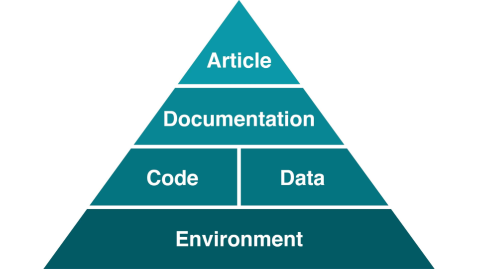
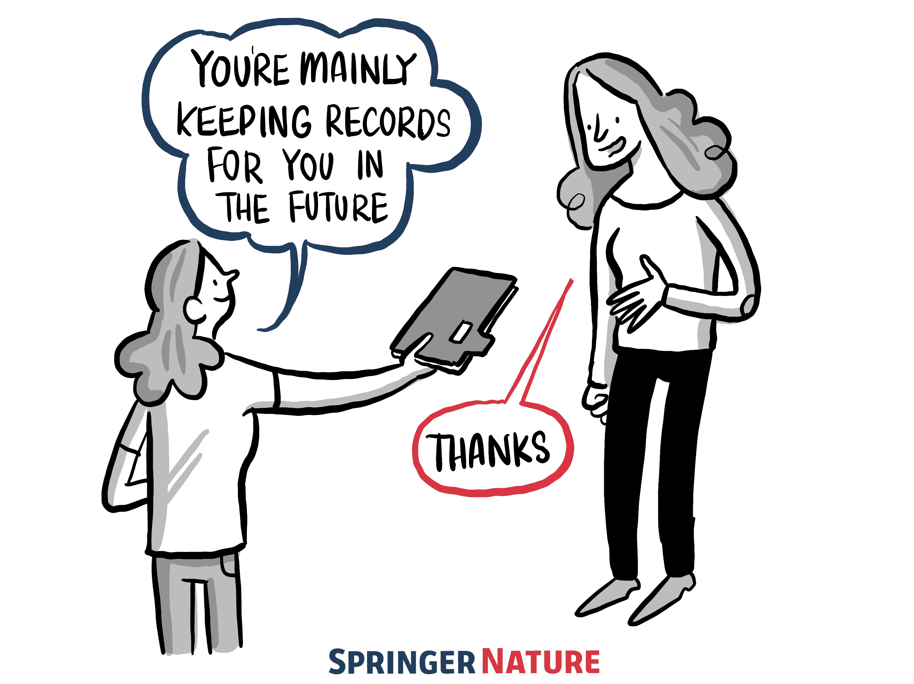

# PhD Retreat: Open Science and reproducibility

19.03.24

Henrik Finsberg

---

## About me

- 2014: Master in applied mathematics from NTNU, Trondheim
- 2014 - 2017: PhD: Computational Physiology, Simula
- 2017 - 2021: Research Engineer, Computational Physiology, Simula
- 2021 - present: Senior Research Engineer, Computational Physiology, Simula
- 2018 - present: Lecturing at UiO: IN1910 - programming for scientific applications

- I work on developing research software for cardiac applications
- I am a tools geek, and like to try out new software tools that can help me in my work

---

<!--
Here are the general steps needed fro reproducible research
-->

Image is used under a CC-BY 4.0 license. https://twitter.com/HeidiBaya/status/1579385587865649153.

---

## Plan this workshop

- What is reproducibility, and why do we need it?
- Organizing your projects (version control)

---

- Recording dependencies and environment
- Recording computational steps
  - Testing
  - Automation with GitHub workflows
  - Exercises
- Example papers and concluding remarks

---

## Material from the workshop

- https://github.com/scientificcomputing/phd-retreat-190324
- https://scientificcomputing.github.io/phd-retreat-190324

Based on material from
- https://github.com/scientificcomputing/seminar-23-11-2023
- https://coderefinery.github.io/reproducible-research/
- https://the-turing-way.netlify.app/reproducible-research/reproducible-research

---

## Scenario 1

- You have submitted your first paper to a journal
- One of the reviewers asks for new figures and some additional analysis
- You rerun the analysis but you are unable to recreate the figures from the initial submission

* Alternative version: A new PhD student starts, and will be building upon previous work done by you

---

---

Baker, M. 1,500 scientists lift the lid on reproducibility. Nature 533, 452–454 (2016). https://doi.org/10.1038/533452a.

---

## A reproducible article needs a good foundation

Steeves, Vicky (2017) in “Reproducibility Librarianship,” Collaborative Librarianship: Vol. 9: Iss. 2, Article 4. Available at: https://digitalcommons.du.edu/collaborativelibrarianship/vol9/iss2/4]

---

## Discussion in groups (department-wise)

- Did you find any issues while trying to reproduce the results article that was handed out?
- What was missing?

---

## What is reproducibility?

<!--
Start by asking the students what they think
-->

* A result is reproducible when the same analysis steps performed on the same dataset consistently produces the same answer.
* Same data + Same code -> Same results

---

<!--
Reproducible: same analysis steps performed on the same dataset consistently produces the same answer.

Replicable: same analysis performed on different datasets produces qualitatively similar answers.

Robust: A result is robust when the same dataset is subjected to different analysis workflows to answer the same research question (example: benchmarks)

Generalizable: Result is not dependent on a particular dataset nor a particular version of the analysis pipeline
-->

Taken from https://the-turing-way.netlify.app/reproducible-research/overview/overview-definitions under a CC-BY 4.0 license

---

## Advantage of working reproducible?

<!--
Ask the students
-->

---

## Advantage of working reproducible?

<!--
1. Easy to see the history of the project, what happened in what order (provenance)
2. Easier to collaborate with others, and for others to build upon your work
3. Results can be validated easily, and we can trust the results.
4. You and your collaborators spend less time figuring how to generate results
5. You will get more citations, because it is easier to build upon your work
6. Ensures continuity in research, because it is easier to build upon your work
-->

Taken from https://the-turing-way.netlify.app/reproducible-research/overview/overview-benefit under a CC-BY 4.0 license

---

---

## Barriers to reproducibility

<!--
Ask the students
-->

* Why is it so hard to make research reproducible?

---

 Used under a CC-BY 4.0 license. DOI: 10.5281/zenodo.2669547.#

---

## Next up: Organizing your projects

https://scientificcomputing.github.io/phd-retreat-190324/organizing-slides
