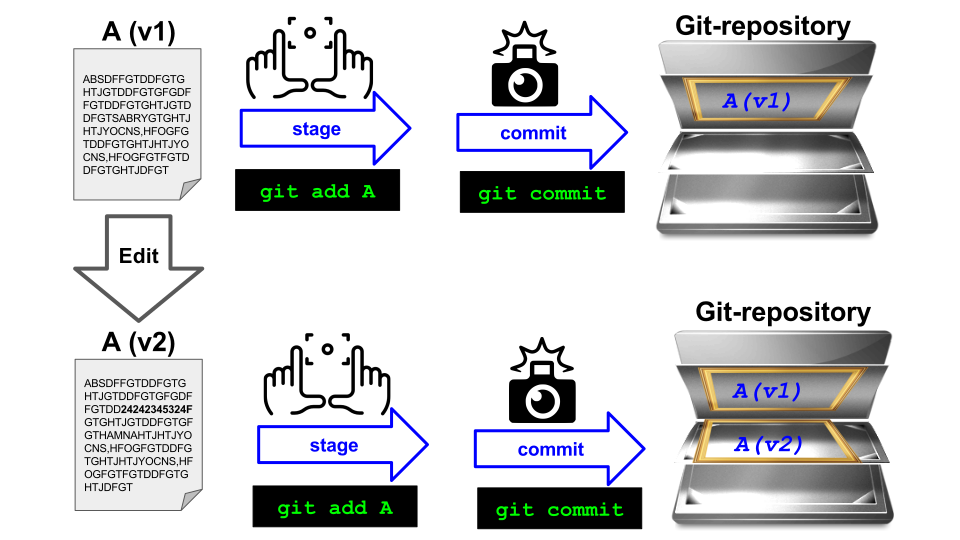

# Organizing your projects

- `git` version control system
- Creating a folder structure
- GitHub for backup and collaboration
- Licenses
- Data


---

## Why version control systems?

<!--
Ask the student if they are familiar with git
See if some of them already have an idea on what are the
benefits of using version control
-->

* To keep a history of what has been changed and why
* To make it easy to go back to a previous version
* To make changes while maintaining a working version


<p class="small-text">Image is used under a CC-BY 4.0 license. DOI: 10.5281/zenodo.3332807.</p>

---


<p class="small-text">Image is used under a CC-BY 4.0 license. https://coderefinery.github.io/git-intro/basics/.</p>


---

## Resources for learning about git

<!--
Here are some resources, also with links to additional resources.
For now I will assume a very basic understanding of git
-->

- https://coderefinery.github.io/git-intro/
- https://the-turing-way.netlify.app/reproducible-research/vcs/vcs-resources#further-reading


---


## Setting up your first project

<!--
When setting up your first project it is nice to have a template for which files that should be part of the project
We have created two template repos for this which will basically copy all the files from that repo into your own repo

Cookiecutter is another alternative where you run a command an it will prompt you with some questions an fill it in

Note! These examples are very python centric. How many are not primarily using python
-->

- Templates
    - Copy all files from an existing repository
    - https://github.com/scientificcomputing/example-paper
    - https://github.com/scientificcomputing/example-paper-fenics

- Cookiecutters
    - Script that generate the files based on a few questions
    - https://github.com/scientificcomputing/generate-paper
    - https://github.com/scientific-python/cookie
    - https://www.cookiecutter.io/templates

---


## Demo cookiecutter


```
python3 -m pip install cookiecutter
python3 -m cookiecutter gh:scientificcomputing/generate-paper
```
(Here you can also use [pipx](https://pypa.github.io/pipx/))

---

```
research_paper_1
├── .gitignore              # List files to be excluded from git
├── .github                 # Automated workflows with GitHub actions
├── .pre-commit-config.yaml # Pre-commit hooks
├── CITATION.cff            # Info about how to cite your project
├── LICENSE                 # The license
├── README.md               # What the user should read first
├── _config.yml             # Configurations for docs
├── _toc.yml                # Table of contents for docs
├── code                    # Where to put your code
│   └── README.md           # Description of the code
├── cspell.config.yaml      # Dictionary for spell checker
├── data                    # Where to put your data
│   └── README.md           # Description of the data
├── docker
│   └── Dockerfile          # The docker file
├── docs                    # Where to put your docs
│   ├── logo.png            # Simula Logo to put in documentation
│   └── references.bib      # Where to put your references
├── environment.yml         # Conda dependencies
└── pyproject.toml          # Python metadata and dependencies
```

---

## Personal preference

- I usually just copy files from an existing project that I have locally and edit the files

---

## Writing a README file

- The first documentation a user reads is the README file
- `README.md` (markdown) - https://www.markdownguide.org/basic-syntax/
- Should include
  - Title of the project
  - Description of the project
  - Installation instructions
  - How to get started

---

## The README file (continued)

- ### Optional
  - Badges
  - Information about how to contribute
  - License information (should also be in a separate file)
  - Credits
  - Example
  - How to cite
  - Screenshots / figures
* README skeleton generator: https://readme.so

---

## What is GitHub?

* A place to host your remote repositories
* To make it easier to collaborate with others
* To keep a backup
* Create repositories under your group's GitHub organization (this will make it easier if you are unavailable)
    - https://github.com/scientificcomputing
    - https://github.com/ComputationalPhysiology

---


## Versioning

* When you think that your code is ready for external users, it is time to create your first release
* Your code should get a version number.
* Create a release when you submit your paper.
* `MAJOR.MINOR.MICRO`
* Specify the version number in `pyproject.toml`
* Semantic or Calendar based versioning

---

## Calendar based versioning

https://calver.org

- YEAR.MONTH.DAY
- YEAR.MONTH.NUMBER
- YEAR.NUMBER
- ...
- e.g 2023.11.4


---

## Semantic versioning

https://semver.org

- `major.minor.micro` e.g `0.1.2`
- Bump micro / patch: Bug fixes not affecting the API
- Bump minor: Backward compatible API additions/changes
- Bump major: Backward incompatible API changes
- Typically start with `0` major version and bump to `1` when ready for users.
---

## Publish a new release

* Bump version in `pyproject.toml`
* Create a git tag once you have bumped the version
    ```
    git tag v0.1.2
    git push --tags
    ```
* Create a release on GitHub and write a changelog
    - It is also possible to create a tag during this step

---


## Write a changelog

* List the notable changes since the previous release
    - For the first release you don't need a changelog

* Information about changes are important for the users

* https://keepachangelog.com/en/1.0.0/

---

## Tools for managing versions and tags

- [`bump-my-version`](https://github.com/callowayproject/bump-my-version)
- [`tbump`](https://github.com/your-tools/tbump)


---

## Demo / Exercise: bump the version

- Change the version of your paper
- Create a new tag and release

---

## Licenses

- What can other users do with the material in your repository?
- No license means the nobody can use, copy, distribute, or modify the work without consent from the author
* Add a file called LICENSE to your repository. Go to GitHub, click "Add file" and type the name `LICENSE` and GitHub will provide you with some options

---

## What license to choose?

- MIT: Permissive - Others can use your code in any way, and you will not be sued if the software doesn't work (recommended in most cases)
- GPL: Copyleft - derivative work must use the same license - good way to embrace open source but often problematic for commercial companies
- LGPL: Similar to GPL but software can be used under different license
- CC-BY-4.0 - Typically used for creative work (most journals use this)

https://choosealicense.com

---
